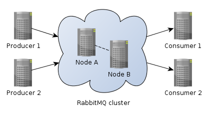
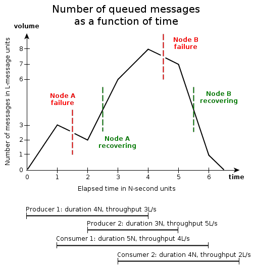
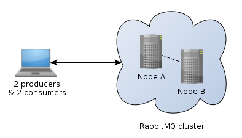
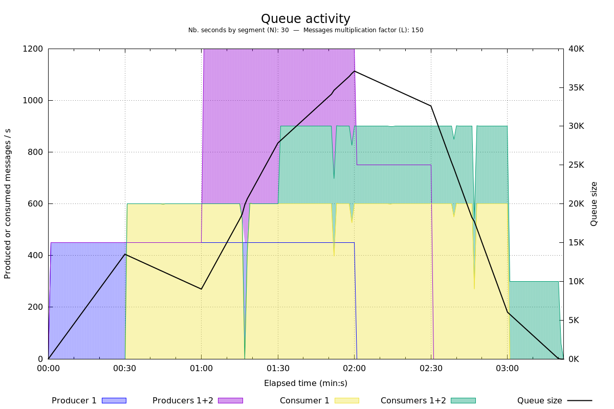
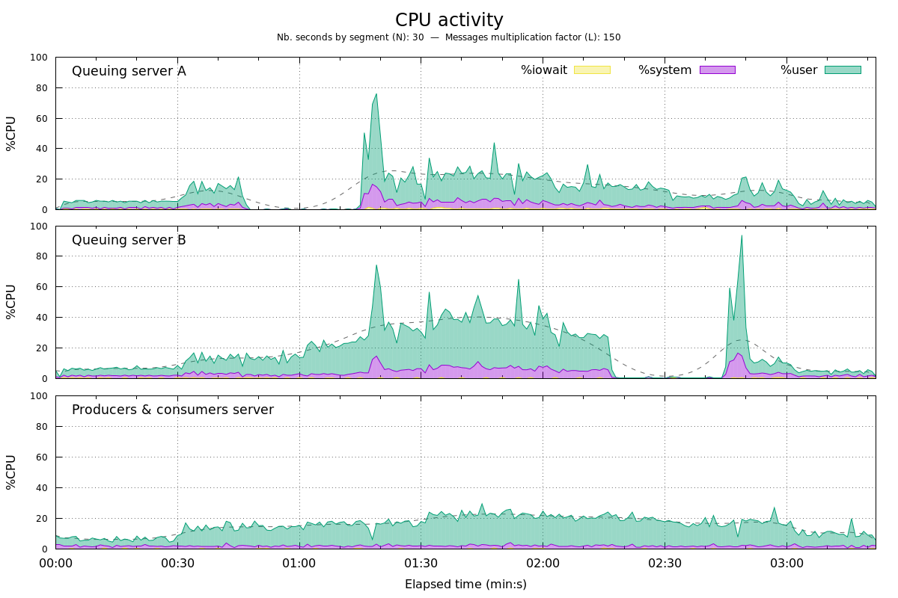
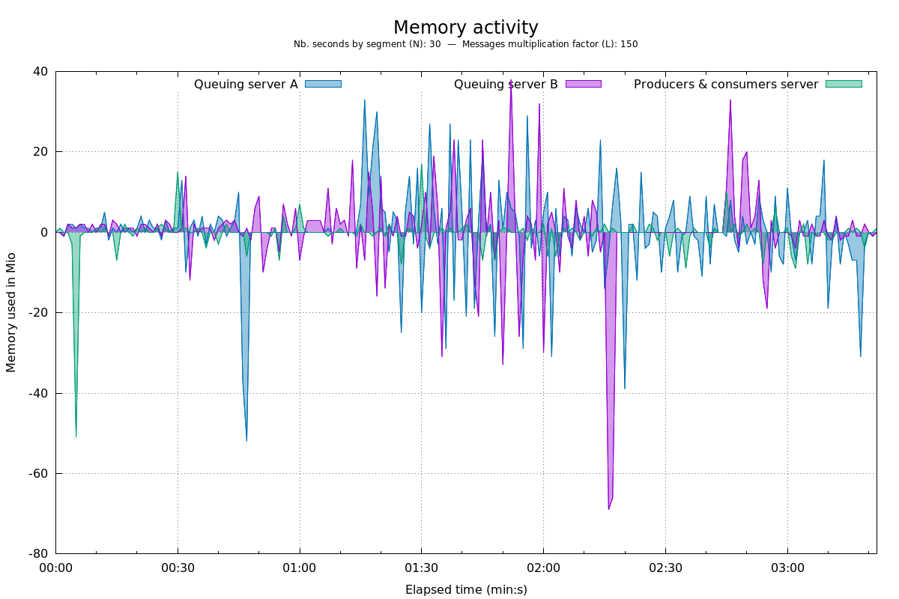

# RabbitMQ stress test

## Table of Contents

  * [Overview](#overview)
  * [Scenario](#scenario)
  * [Installation & configuration](#installation--configuration)
  * [Usage](#usage)
  * [Run stress test & results](#run-stress-test--results)
  * [Change log](#change-log)
  * [Contributions](#contributions)
  * [Versioning](#versioning)
  * [Git branching model](#git-branching-model)
  * [Copyrights & licensing](#copyrights--licensing)
  
## Overview

Here is a scenario and its PHP implementation (using [php-amqplib](https://github.com/videlalvaro/php-amqplib))
to stress test a [RabbitMQ](http://www.rabbitmq.com) cluster
with [highly available queues](https://www.rabbitmq.com/ha.html).

A variable number of both producers and consumers will interact with a mirrored queue across the two nodes of a cluster.
These nodes will suddenly shut down and recovering according to scenario.

We ensure that all expected messages will be produced and consumed, without any service interruption.

Charts are automatically generated to follow and analyze:

 * messages production,
 * messages consumption,
 * number of messages in mirrored queue,
 * CPU usage,
 * memory usage.

Architecture big picture:



## Scenario

It's a stress test, not a load test
(_cf._ [Load test vs. stress test](http://en.wikipedia.org/wiki/Stress_testing_(software)#Load_test_vs._stress_test), Wikipedia).

To control scenario's execution we introduce 2 parameters concerning both producers and consumers:

* let `N` the unit of duration in seconds,
* let `L` the unit of number of messages produced or consumed.

Detailed scenario in function of `N` and `L` is this:



#### Combinations producer/consumer occuring during scenario

<table>
    <tr>
        <th rowspan="2" colspan="2"></th>
        <th colspan="3">Active Producers</th>
    </tr>
    
    <tr>
        <th>0</th>
        <th>1</th>
        <th>2</th>
    </tr>
    
    <tr>
        <th rowspan="3">Active<br />Consumers</th>
        <th>0</th>
        <td align="center"></td>
        <td align="center"></td>
        <td align="center"></td>
    </tr>
    
    <tr>
        <th>1</th>
        <td align="center"></td>
        <td align="center"></td>
        <td align="center"></td>
    </tr>
    
    <tr>
        <th>2</th>
        <td align="center"></td>
        <td align="center"></td>
        <td align="center"></td>
    </tr>
</table>

#### Produced messages

All produced messages are randomly generated.
They contains 170 characters:

```json
{
  "id":"a597f-001799",
  "data":{
    "name":      "28fda771c62487aa597fa293fd9fa00f28fda771c62487a",
    "age":       68,
    "timestamp": 1390293734.0737,
    "full_id":   "a597fa293fd9fa00f28fda771c62487a"
  }
}
```

It takes only 1 second to generate 100000 messages from PHP script.

## Installation & configuration

Deployed architecture:



### Producers and consumers

1. Require PHP5.3+, [composer](https://getcomposer.org/), [sysstat](https://github.com/sysstat/sysstat) and SSH/SCP to RabbitMQ nodes.
    
    If needed:
    
    ```bash
    $ curl -sS https://getcomposer.org/installer | php
    $ sudo apt-get install sysstat
    ```

1. Clone this repository:

    ```bash
    $ git clone git@github.com:Hi-Media/rabbitmq-stress-test.git
    ```

1. Install PHP dependencies:

    ```bash
    $ cd rabbitmq-stress-test/
    $ composer install
    ```
    
1. Ensure you can SSH to nodes specifying hostname.
    Add entries in `/etc/hosts` if needed.

#### Configuration

1. Create config file:

    ```bash
    $ cp conf/queuing-dist.php conf/queuing.php
    ```

2. Just adapt `cluster_rabbitmq` section. For example:

    ```php
    return array(
        'AMQP' => array(
            // [...]
    
            // Rabbitmq cluster: array(
            //     array('ip or hostname', port, 'login', 'password'),
            //     …
            // )
            'cluster_rabbitmq' => array(
                array('nodeA', 5672, 'guest', 'guest'),
                array('nodeB', 5672, 'guest', 'guest')
            ),
    ```

### RabbitMQ cluster

1. Require [sysstat](https://github.com/sysstat/sysstat) on each RabbitMQ nodes.
    
    If needed:
    
    ```bash
    $ sudo apt-get install sysstat
    ```
    
1. Just install RabbitQM on all 2 servers following [official guide](https://www.rabbitmq.com/install-debian.html).
    Later, [scenario's scripts](/scripts/rabbitmq) will create cluster and add policy for highly available queue.

1. Ensure you can SSH from one node to other one specifying hostname.
    Add entry in `/etc/hosts` if needed.

## Usage

Stress test's entry point:

```bash
$ php src/rabbitmq/stress_test.php
Usage: src/rabbitmq/stress_test.php [options] [operands]
Options:
  -n, --sec-per-segment <arg> Nb seconds per segment (default 10)
  -l, --load-factor <arg> Msg multiplication factor (default 1)
  -o, --output <arg>      Output directory (default '/tmp')
  --is-durable <arg>      Is a durable queue? (1/0, default 1)
  --queue-name <arg>      Name of the queue (default 'noname')
  -h, --help              Display this help
```

Launch a consumer:

```bash
$ php src/rabbitmq/producer.php 
Usage: src/rabbitmq/producer.php [options] [operands]
Options:
  -d, --duration <arg>    Test duration in seconds (default 1)
  -t, --throughput <arg>  Nb of messages to send per second (default 0=no limit)
  -o, --output <arg>      Output directory (default '')
  --is-durable <arg>      Is a durable queue? (1/0, default 1)
  --with-acks <arg>       Waiting server acks? (1/0, default 1)
  --queue-name <arg>      Name of the queue (default 'noname')
  -h, --help              Display this help
```

Launch a producer:

```bash
$ php src/rabbitmq/consumer.php 
Usage: src/rabbitmq/consumer.php [options] [operands]
Options:
  -d, --duration <arg>    Test duration in seconds (default 1)
  -t, --throughput <arg>  Nb of messages to send per second (default 0=no limit)
  -o, --output <arg>      Output directory (default '')
  --is-durable <arg>      Is a durable queue? (1/0, default 1)
  --queue-name <arg>      Name of the queue (default 'noname')
  -h, --help              Display this help
```

Reset cluster:

```bash
$ scripts/rabbitmq/reset_server.sh <nodeA>
$ scripts/rabbitmq/reset_server.sh <nodeB>
$ scripts/rabbitmq/add_server_to_cluster.sh <nodeB> <nodeA>
```

## Run stress test & results

### Run

With `N=30` and `L=150`:

```bash
$ php src/rabbitmq/stress_test.php \
    --sec-per-segment 30 \
    --load-factor 150 \
    --output /tmp/rabbitmq_`date +'%Y-%m-%d_%H-%M-%S'` \
    --is-durable 0 \
    --queue-name ha-test
```

### Results

* Availability: 100%
* Without any manual intervention.
* All messages well produced and consumed.

CPU graph shows when shut down and recovery occured for both two nodes.
CPU peaks reveal automatic synchronisation when a new node joins.

Charts are automatically generated in output directory (here ``/tmp/rabbitmq_`date +'%Y-%m-%d_%H-%M-%S'` ``):







## Change log
See [CHANGELOG](CHANGELOG.md) file for details.

## Contributions
All suggestions for improvement or direct contributions are very welcome.
Please report bugs or ask questions using the [Issue Tracker](https://github.com/Hi-Media/rabbitmq-stress-test/issues).

## Versioning

For transparency into our release cycle and in striving to maintain backward compatibility,
Padocc's engine is maintained under [the Semantic Versioning guidelines](http://semver.org/).
We'll adhere to these rules whenever possible.

## Git branching model
The git branching model used for development is the one described and assisted by `twgit` tool: [https://github.com/Twenga/twgit](https://github.com/Twenga/twgit).

## Copyrights & licensing
Licensed under the GNU General Public License v3 (GPL-3.0+).
See [LICENSE](LICENSE) file for details.
